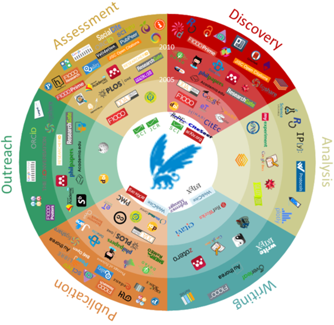

### TESTING 
### the version control 
### of GITHUB
---
title: "Raport - VU innovations in Scholarly Communication"
author: "Maurice Vanderfeesten, Marjet Elemans"
date: "June 13, 2016"
output: html_document
---

De UBVU sluit haar dienstverlening graag zo dicht mogelijk aan bij het wetenschappelijke communicatieproces van de onderzoekers van VU en VUmc.

Het wetenschappelijke communicatieproces is volop in beweging. Dit komt door de inzet van digitale middellen binnen de onderzoeksfases: Discovery, Analysis, Writing, Publication, Outreach en Assessment.

Het project doet onderzoek naar naar wat het gebruik is van deze digitale middelen binnen het VU en VUmc, en sluit hierbij aan bij een internationaal onderzoek waardoor resultaten vergeleken kunnen worden met andere landen.

De onderstaande resultaten zijn bedoeld als gespreksstof met de faculteiten om de dienstverlening te verbeteren, vernieuwen en te veranderen, zodat ze beter aansluit bij de fases van de onderzoekspraktijk van de onderzoekers.

# Aanpak
Er zijn [onderzoeksvragen](https://docs.google.com/document/d/1p3k5PLXtJNvGviWvsBoPZ4dbgGU9Fa_dHb08iOdvC6Q/edit?usp=sharing) door de vak- en thema specialisten opgesteld. Dit zijn de vragen die nodig zijn om het gesprek te voeren. Voor elke vraag is een raamwerk gemaakt waarbinnen het antwoord vanuit de enquete resultaten kan worden gegeven. Vanuit het oogpunt tijd, is gekozen om alleen de vragen te beantwoorden met de hoogste urgentie.

De vragen moeten antwoord geven voor twee vraag-categoriën:
1. Het toolgebruik binnen de VU in haar geheel
2. Het toolgebruik binnen Disciplines 

Met name de laatste vraag-categorie is interessant voor vak- en themaspecialisten, waar ze inzicht krijgen in het tool-gebruik binnen de discipline die ze vertegenwoordigen.

# Data gathering
Met deze enquete hebben we meegelift bij een bestaand onderzoek van Kramer, B. and Bosman, J. *Innovations in scholarly communication - global survey on research tool usage* [version 1; referees: awaiting peer review]. F1000Research 2016, 5:692
[(doi: 10.12688/f1000research.8414.1)](http://dx.doi.org/10.12688/f1000research.8414.1)

We hebben een custom URL aangevraagd waardoor VU en VUmc onderzoekers in de binnengekomen data is te onderscheiden met de hash 7V4u8a. Van deze custom URL is een verkorte URL gemaakt [http://bit.ly/vu101innovations], zodat we de activiteit van de verspreiding makkelijker bij konden houden. We hebben aan de portefeuillehoudersonderzoek gevraagd deze verkorte URL door te sturen naar hun onderzoekers.


In twee e-mail acties leverde het in januari een activiteit op van 543 bezoekers, en in februari 296 bezoekers, in totaal 839 bezoekers.

De VU en VUmc hebben bijelkaar ongeveer 6000 personen wetenschappelijke staf.

# Resultaten
De vraag-categorien komen ook terug in de nummering van de resultaten.

Elke vraag bevat een antwoord, aangevuld met diagrammen. Een vraag begint met een samenvattende uitleg en diagram en daarna volgen de sub-secties met gedetailleerdere diagrammen.

De Scholarly Communication Fases zullen gedurende het hele rapport terug komen: Discovery, Analysis, Writing, Publication, Outreach en Assessment. 

```{r echo=FALSE, warning=FALSE, message=FALSE}
source("MainBasic.R")
```

# Demografische gegevens

## Survey outcomes


| Number of respondents | Value |
| --- | ---: |
| world wide | 20663 |
| VU and VUmc | 531 |

**The values below are within the set of VU & VUmc respondents.**

| Discipline (multi-choice) | Value |
| --- | ---: |
| Physical Sciences | 39 |
| Engineering & Technology | 35 |
| Life Sciences | 144 |
| Medicine | 181 |
| Social Sciences & Economics | 176 |
| Law | 26 |
| Arts & Humanities | 55 |

| Role | Value |
| --- | ---: |
| Number of PhD's | 230 |
| Number of PostDoc's | 70 |
| Number of (Associate, Assistant) Professors | 188 |

| First publication year | Value |
| --- | ---: |
| before 1991 | 61 |
| 1991-2000 | 70 |
| 2001-2005 | 55 |
| 2006-2010 | 79 |
| 2011-2016 | 168 |
| not published (yet) | 96 |

| Country of affiliation | Value |
| --- | ---: |
| Netherlands | 519 |
| United States | 3 |
| Germany | 2 |
| Brazil | 1 |
| DR of Congo | 1 |
| India | 1 |
| Italy | 1 |
| Latvia | 1 |
| Turkey | 1 |

## Organisation demographics VU&VUmc
| Faculty | Number of scientific personnel |
| --- | ---: |
| Godgeleerdheid | 0 |
| Geesteswetenschappen | 0 |
| Rechtsgeleerdheid | 0 |
| Sociale Wetenschappen | 0 |
| Economische Wetenschappen en Bedrijfskunde | 0 |
| Exacte Wetenschappen | 0 |
| Aard- en Levenswetenschappen | 0 |
| Gedrags- en Bewegingswetenschappen | 0 |
| Geneeskunde | 0 |
| Tandheelkunde (ACTA) | 0 |

## Survey disciplines and faculty
| Survey Discipline | Faculty | Number of scientific personnel |
| --- | --- | ---: |
| Physical Sciences | Exacte wetenschappen | 0 |
| Engineering & Technology | Exacte wetenschappen | 0 |
| Life Sciences | Aard- en Levenswetenschappen  | 0 |
| Medicine | Aard- en Levenswetenschappen AND Geneeskunde AND Tandheelkunde (ACTA) | 0 |
| Social Sciences & Economics | Sociale Wetenschappen AND Economische Wetenschappen en Bedrijfskunde | 0 |
| Law | Rechtsgeleerdheid | 0 |
| Arts & Humanities | Godgeleerdheid AND Geesteswetenschappen | 0 |


# Popular tools vs Library supported tools (1.3.1) 

The popularity of a tool is indicated by the response of the survey. The services the Library offers is indicated by the [Library services price list available on VUnet](https://vunet.login.vu.nl/services/pages/practicalinformation.aspx?cid=tcm%3a165-344598-16).
Library supported tools are indicated with filled colors in the bars. 

## Top 3 per research phase
```{r child="Vraag131.top3.fasen.Rmd", echo=FALSE, fig.width=10, fig.height=6}
```

## All tools per research activity

```{r child="Vraag131.AlleTools.subfasen.Rmd", echo=FALSE}
```

# VU&VUmc vs OECD countries
Dispite the fact that the survey has responses from most of the countries in the world. We have limited ourselves to countries that look like ours. We saw for example more usage of Zotero (free of charge) in countries with lower GDP, and more usage of EndNote (paid) in countries with a higher GDP.
We selected responses where the affiliated country of the respondent is one of the EOCD countires. We used the state of [OECD membership](http://www.oecd.org/about/membersandpartners/list-oecd-member-countries.htm) from the date 2016-05-03, which accounts for 34 member states.

```{r child="Vraag132.AlleTools.subfasen.Rmd", echo=FALSE}
```

# Carreer groups and Tool usage (1.1.1)
At this stage we would like to see if there are tools used that differ between the academic carreergroups at the VU and VUmc.
In the data we labeled the phds and post docs as non-tenured and the other (assistant) professors were labeled as tenured researchers.

## Extremities
The figure below shows only the tools with the biggest difference between tenures users and non-tenured researchers.

Please note that the bars of the Tenured group is filled with the color of the research phase. The bars of the Non-tenured group are shaded.

Tools to the **left** of each graph are used more by the **Tenured** group. 
Tools to the **right** of each graph are used more by the **Non-Tenured** group. 

```{r child="Vraag111.top2.fasen.Rmd", echo=FALSE}
```

## Details
Here we see all tools in the survey sorted by research phase and research activity. 
```{r child="Vraag111.AlleTools.subfasen.Rmd", echo=FALSE}
```

---
# TODO
---

# Open Access and Open Science (2.2.2)
## Tenures vs Non-tenures
```{r child="Vraag222.OAsupport.Rmd", echo=FALSE}
```

## Per Discipline: Open Access and Open Science
```{r child="Vraag222.OAsupport.per.discipline.Rmd", echo=FALSE}
```

# Tools per discipline (2.1.1)
## Most used tool per Research Phase
```{r child="Vraag211.top1.tabel.Rmd", echo=FALSE}
```

## Tools per Research activity
```{r child="Vraag211.PerDiscipline.subfasen.Rmd", echo=FALSE}
```


