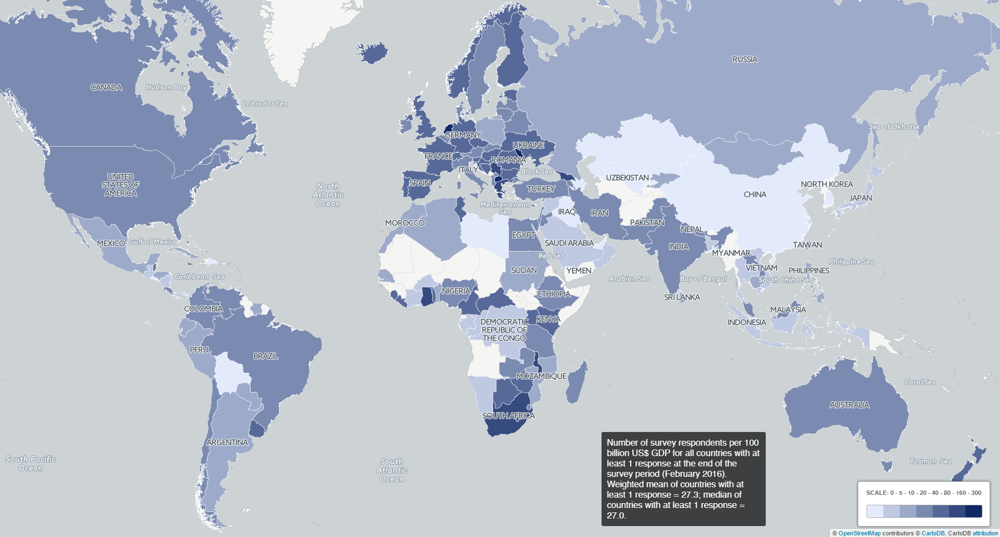

# Rapport - VU innovations in Scholarly Communication
[Maurice Vanderfeesten](http://orcid.org/0000-0001-6397-4759), [Matthijs de Zwaan](http://orcid.org/0000-0002-6983-2118), [Marjet Elemans](http://orcid.org/0000-0002-4516-9489)  
July 19, 2016  
<!-- preparing all data for plots -->


<!-- Introduction -->

<!-- English or Dutch? First part of the report is written in dutch, then switches to English. Axis titles in the figures are also in Dutch -->


De UBVU wil haar dienstverlening graag zo dicht mogelijk laten aansluiten bij het wetenschappelijke communicatieproces van de onderzoekers van VU en VUmc.

Het wetenschappelijke communicatieproces is volop in beweging. Dit komt door de inzet van digitale middelen binnen de onderzoeksfases: Discovery, Analysis, Writing, Publication, Outreach en Assessment.

Het project doet onderzoek naar naar wat het gebruik is van deze digitale middelen binnen het VU en VUmc, en sluit hierbij aan bij een internationaal onderzoek waardoor resultaten vergeleken kunnen worden met andere landen.

De onderstaande resultaten zijn bedoeld als gespreksstof met de faculteiten om de dienstverlening te verbeteren, vernieuwen en te veranderen, zodat ze beter aansluit bij de fases van de onderzoekspraktijk van de onderzoekers.

# Aanpak
Er zijn [onderzoeksvragen](https://docs.google.com/document/d/1p3k5PLXtJNvGviWvsBoPZ4dbgGU9Fa_dHb08iOdvC6Q/edit?usp=sharing) door de vak- en thema specialisten opgesteld. Dit zijn de vragen die nodig zijn om het gesprek te voeren. Voor elke vraag is een raamwerk gemaakt waarbinnen het antwoord vanuit de enquete resultaten kan worden gegeven. Vanuit het oogpunt tijd, is gekozen om alleen de vragen te beantwoorden met de hoogste urgentie.

De vragen moeten antwoord geven voor twee vraag-categori?n:
1. Het toolgebruik binnen de VU in haar geheel
2. Het toolgebruik binnen Disciplines

Met name de laatste vraag-categorie is interessant voor vak- en themaspecialisten, waar ze inzicht krijgen in het tool-gebruik binnen de discipline die ze vertegenwoordigen.

# Data gathering
Met deze enquete hebben we meegelift bij een bestaand onderzoek van Kramer, B. and J. Bosman, _Innovations in scholarly communication - global survey on research tool usage_ [version 1; referees: awaiting peer review]. F1000Research 2016, 5:692
[(doi: 10.12688/f1000research.8414.1)](http://dx.doi.org/10.12688/f1000research.8414.1)

We hebben een custom URL aangevraagd waardoor VU en VUmc onderzoekers in de binnengekomen data is te onderscheiden met de hash 7V4u8a. Van deze custom URL is een verkorte URL gemaakt [http://bit.ly/vu101innovations], zodat we de activiteit van de verspreiding makkelijker bij konden houden. We hebben aan de portefeuillehoudersonderzoek gevraagd deze verkorte URL door te sturen naar hun onderzoekers.


In twee e-mail acties leverde het in januari een activiteit op van 543 bezoekers, en in februari 296 bezoekers, in totaal 839 bezoekers.

De VU en VUmc hebben samen ongeveer 6000 personen wetenschappelijke staf.

# Resultaten
De vraag-categorien komen ook terug in de nummering van de resultaten.

Elke vraag bevat een antwoord, aangevuld met diagrammen. Een vraag begint met een samenvattende uitleg en diagram en daarna volgen de sub-secties met gedetailleerdere diagrammen.

De Scholarly Communication Fases zullen gedurende het hele rapport terug komen: Discovery, Analysis, Writing, Publication, Outreach en Assessment.


<!-- # Demographics -->

# Demographics
These demographics form the baseline of our study.

## Survey outcomes

| Number of respondents | Value |
| --- | ---: |
| World Wide | 20663 |
| OECD countries | 15752 |
| Netherlands | 2041 |
| VU and VUmc | 531 |

<!-- -->

```
## NULL
```


[More global demographics...](http://dashboard101innovations.silk.co/page/Demographics)

**The values below are within the set of VU & VUmc respondents.**

| Discipline (multi-choice) | Value |
| --- | ---: |
| Physical Sciences | 39 |
| Engineering and Technology | 35 |
| Life Sciences | 144 |
| Medicine | 181 |
| Social Sciences and Economics | 176 |
| Law | 26 |
| Arts & Humanities | 55 |

<!-- -->

```
## NULL
```

| Role | Value |
| --- | ---: |
| Number of PhD's | 230 |
| Number of PostDoc's | 70 |
| Number of (Associate, Assistant) Professors | 188 |

| First publication year | Value |
| --- | ---: |
| before 1991 | 61 |
| 1991-2000 | 70 |
| 2001-2005 | 55 |
| 2006-2010 | 79 |
| 2011-2016 | 168 |
| not published (yet) | 96 |

| Country of affiliation | Value |
| --- | ---: |
| Netherlands | 519 |
| United States | 3 |
| Germany | 2 |
| Brazil | 1 |
| DR of Congo | 1 |
| India | 1 |
| Italy | 1 |
| Latvia | 1 |
| Turkey | 1 |

## Organisation demographics VU&VUmc
Below the numbers are given for the active scientific personel on 30th of June 2016 for the VU. For VUmc (Medicine), numbers from annual report 2015 are used.

| Faculty | Number of scientific personnel |
| --- | ---: |
| Godgeleerdheid | 86 |
| Geesteswetenschappen | 221 |
| Rechtsgeleerdheid | 219 |
| Sociale Wetenschappen | 224 |
| Economische Wetenschappen en Bedrijfskunde | 430 |
| Exacte Wetenschappen | 390 |
| Aard- en Levenswetenschappen | 450 |
| Gedrags- en Bewegingswetenschappen | 422 |
| Geneeskunde (VUmc) | 1079 |
| Tandheelkunde (ACTA) | 251 |

## Survey disciplines and faculty
To normalize the numbers, and calculating the representation of the the survey respontents to the faculties, the following divisions are used.

| Survey Discipline               | Faculty                           | Number of scientific personnel |
| ------------------------------- | --------------------------------- | -----: |
| Physical Sciences               | Exacte wetenschappen              | 195 |
| Engineering and Technology      | Exacte wetenschappen              | 195 |
| Life Sciences                   | Aard- en Levenswetenschappen      | 450 |
| Medicine                        | Aard- en Levenswetenschappen AND Geneeskunde AND Tandheelkunde (ACTA) | 1780 |
| Social Sciences and Economics   | Sociale Wetenschappen AND Economische Wetenschappen en Bedrijfskunde | 654 |
| Law                             | Rechtsgeleerdheid                 | 219 |
| Arts & Humanities               | Godgeleerdheid AND Geesteswetenschappen | 307 |

# Popular tools vs Library supported tools <!-- (1.3.1) {.tabset .tabset-fade} -->

The charts below show which tools are used most often, as indicated by the responses in the survey. The first set of charts shows a quick summary of the the three most used tools by research phase. The second set gives more detail, and displays usage of all available tools in the different research phases. Bars with a solid fill indicate that the tool is supported by the Library (as indicated on the [Library services price list available on VUnet](https://vunet.login.vu.nl/services/pages/practicalinformation.aspx?cid=tcm%3a165-344598-16)), hatched bars indicate no support.

<!-- ## Top 3 per research phase -->


<!-- ## All tools per research activity -->


##Discovery
Acrobat Reader, Google Scholar, and Institutional Access are all used by approximately 500 respondents. Looking at the more detailed figures showing all tools per research activity, it becomes clear that these tools are not direct competitors: each are leading tools in different research activities. Acrobat Reader is a very poular tool for reading, Google Scholar for searching literature, and Institutional Access to gain access to academic literature. 


##Analysis 
Excel is most widely used within the VU, with SPSS a close second, and R a more distant third. These tools fall within the same activity class, and could be considered rival tools. It is notable that very few reseachers use tools to share there analysis, and it would be interesting to see how this evolves in the future. 


##Writing
Microsoft Word is the most popular writing tool by far, and nearly all respondents indicate that they use Word. The second and third most popular tools in the Writing category are reference managers: Endnote and Mendeley. Endnote is supported by the Library, but Mendeley has only slightly fewer users. 


##Publication
Unsurprisingly, the traditional topical journal (ie, 'closed' access) is still the leading outlet for academic work; more than eighty per cent of respondents with at least one publication indicate they have published in such a journal. The second and third most popular tools, ResearchGate and Open Access topical journals, are Open Access outlets. Note that ResearchGate is seen as a tool for archival, rather than publication. 


##Outreach
Generally, outreach to other academics is more popular than outreach to a broader public. ResearchGate and Google Scholar profiles are the most popular tools in this category. Twitter, and to a lesser extent WordPress, are used as tools for outreach to a broader public. Very few researchers make their presentations available for others. 


##Assessment 
In the assessment phase, researchers mostly use Thomson reuters' Web of Science Journal Citation Reports to measure impact. Scopus is used as well, but much less often, presumably because the VU does not offer access to it. Alternative ('open') ways of peer review have very few users. 


# VU&VUmc vs OECD countries <!-- (1.3.2) {.tabset .tabset-fade} --> 


<!-- # VU&VUmc vs OECD countries -->

Despite the fact that the survey has responses from many different countries, we limit the analysis to the 34 [OECD member states](http://www.oecd.org/about/membersandpartners/list-oecd-member-countries.htm) (checked 3 May 2016), as these countries are more similar to the Netherlands, and comparison is more meaningful. For example, respondents from countries with low GDP often use Zotero (free of charge), while EndNote (paid) is used more in countries with a higher GDP.

The figures below compare respondents from VU University to respondents from OECD countries. OECD respondents are indicated with solid colored bars, VU respondent bars are hashed. All data is reported in percentages, that is, a solid bar up to 80 for google Scholar in the **Discovery_search** graph indicates that 80 per cent of all VU respondents reported using Google Scholar for Search in the Discovery process. We report all tools per subactivity.

Overall, differences between OECD and VU repondents are not very large, but there are a few tools that stand out.

<!--
 - betere legenda maken;
 - axis-beschrijving kan veel korter;
 - y axis beter op (25-)50-(75-)100 %?
 - OECD=incl Nederland?
 - why are some graphs so much higher?
-->


##Discovery
Mendeley is used relatively often at the VU for reading and searching 


##Analysis
Use of SPSS as a tool for analysis is much larger at the VU than for the OECD average. 


##Writing
As in the Discovery phase, Mendeley users for reference management are strongly represented at the VU. The preference for Mendeley is at the expense of all other tools except Endnote. For writing, VU respondents are relatively traditional, with high usage of MS Word and low usage of Google Docs and LaTeX. 


##Publication
Scopus usage is relatively low. Few VU respondents use the institutional repository for archival. 


##Outreach
... 


##Assessment
... 


# Tenured vs non-tenured researchers <!-- (1.1.1) {.tabset .tabset-fade} --> 
In this section, we report on differences in tool usage between tenured and non-tenured researchers. We consider assistant professors, associate professors and full professors as tenured faculty; PhD students and postdoctoral researchers are grouped as non-tenured.

<!-- ## Extremities: Tenures vs Non-tenures -->

<!--## Extremities: Tenures vs Non-tenures-->

The first set of graphs is a quick summary with the tools that show the most pronounced differences between the two groups. We calculate the difference by substracting the use in the tenured group from the use in the non-tenured group (both as percentages). The upper bars show the largest positive difference (ie, the tool is more popular among non-tenured researchers); the lower bars show the largest negative difference.


<!-- ## Details: Tenures vs Non-tenures grouped by research activities -->


The second set of graphs below we show the most pronounced differences to the far right and left of each diagram. Here we see all tools in the survey sorted by research phase and research activity. We calculate the difference by substracting the use in the tenured group from the use in the non-tenured group (both as percentages). The bars on the far-right show the largest positive difference (ie, the tool is more popular among non-tenured researchers); the bars on the far-left show the largest negative difference (ie, the tool is more popular among tenured researchers).

##Discovery
The difference in use for PubMed and table of content announcements for journals stand out as the most significant discrepancies in the Discovery phase. Although not featuring in the 'top-2' figures, the use of Mendely stands out when inspecting the more detailed graphs: non-tenured (generally younger) researchers use Mendeley more often in the Reading, Searching and Alert activities within the Discovery phase. 


##Analysis
Tool use for analysis is stronger with non-tenured researchers across the board. This holds for relatively new (and more open) tools such as R and Python, as well as for long-standing software such as Excel and MATLAB. The large difference for SPSS is no outlier. Tools for sharing analysis scripts are not very popular, and tool usage is low overall. Somewhat unexpectedly, use of the Open Science Framework is stronger for the tenured then for the non-tenured group. This could have to do with some cases where  that the OSF is often used for grant applications, and that this arguably is a more important activity for tenured researchers. 


##Writing
The importance of Mendeley in the research workflow of non-tenured researchers is again apparent in the Writing Phase. Among this group, Mendeley is the most popular reference management software, more popular than Endnote---the most popular reference tool for tenured researchers. For the writing itself, MS Word is by far the most popular tool among both groups. 


##Publication
In general, tenured researchers use more tools in the Publication phase; probably they simply publish more. This makes it difficult to interpret these figures properly. A few tools stand out. First, PubMed is relatively popular for archival of publications for non-tenured researchers, although in absolute terms ResearchGate is the most popular repository for both groups. GitHub is used mostly by non-tenured researchers as a repository for scripts and software code. 


##Outreach
Tenured researchers seem to spend more effort on their research profile, as tool use in this phase is higher for that group. ResearchGate is popular among both groups. Although to a lesser extent (differences are less pronounced), tenured researchers also use more tools for outrecach to a broader public. 


##Assessment
The difference is use of Web of Science indicators for impact assessment is striking: about 55% of tenured researchers indicate using the tool, versus appraximately 20% of non-tenured reseachers. Altmetrics and the PLoS metrics are not very popular (yet) in comparison, and are used by both groups, although slightly more by non-tenured researchers. 


# Open Access and Open Science <!-- (2.2.2) {.tabset .tabset-fade} -->
<!-- ## Open Intention for Tenures vs Non-tenures -->

## Open Intention for Tenures vs Non-tenures


<!-- ## Open Intention per discipline -->

## Open Intention per discipline


# Tools per discipline <!-- (2.1.1) {.tabset .tabset-fade} -->
<!-- ## Most used tool per Research Phase -->

As a quick summary we hafe made a table to show the one most used tool per research phase in each discipline.
A more detailed explanation is given in the section below the table, but for the one most used tool we can state the following:

- *Discovery:* Most disciplines use Google Scholar to discover new literature. Medicine use PubMeb as their primary source for search. One could say that Lifesciences find having campus access to literature more important than searching for that literature, but in the detail section below we see a more elaborate explanation, where their attention for search is spread between Google Scholar and PubMed.

- *Analysis:* MS Excel is the most popular tool for analysis in all disciplines, except for Medicine where they use SPSS.

- *Writing:* Here MS Word is the most popular tool for writing in all disciplines, except for Engineering&Technology where they use LaTeX.

- *Publication:* Pubishing in Traditional Topical journals is still by far the most popular publication method, despite of the high support for Open Access.

- *Outreach* ResearchGate is the most popular platform for profiling your research within the research community, except for two disciplines who use RG slightly less. Engineering&Technology use Google Scholar Citations a bit more, and Arts&Humanities use Academia.edu more.

- *Assessment:* Physics, Medicine, Lifesciences and Law use Web of Science for assessment of their research, and the oter disciplines use the Journal Citation Register, which both contain the same impact factor calculated from journals in the ISI database. Internationally there is a lot of debate going on if the [merit of an article should count](http://www.nature.com/news/beat-it-impact-factor-publishing-elite-turns-against-controversial-metric-1.20224?WT.mc_id=TWT_NatureNews), and not the merit of the journal. Also discussed is the reward sysem to give [credit where credit is due](http://www.nature.com/news/publishing-credit-where-credit-is-due-1.15033).


<!-- ## Tool usage grouped by discipline and grouped by research activity -->


In the sections below we show the tool usage for each research discipline next to each other. 
This gives us the opportunity to see if there is a discipline usign a tool more or less than others.

##Discovery
- For **reading articles** the majority of the disciplines use pdf, half of them read online in a browser. Also Mendeley is pretty known,  but lesser in Law and Arts & Humanities, where they seem to prefer to use iAnnotate instead. ReadCube seems to have a targeted audience for Physics and Engineering. Hypothesis and UtopiaDocs are promising tools young tools and haven't have a big uptake yet.
- Google Scholar is overwhelmingly used for **searching literature** by all disciplines, adding to that for medicine and life sciences pubmed is widely used. World Cat is mostly used by Law and Art & Humanities. From the two competing bibliographic databases Scopus and Web of Science, the later has -not surprisingly because the VU Library has a license-  more uptake, especially by Physics and Social sciences and Economics. We are surprised that Scopus is used, where people should get access from elsewhere. Most users from Scopus are in Physics and Engineering. Compared to [OECD countries](#6_vuvumc_vs_oecd_countries_), these countries use Scopus almost a factor three more than VU and VUmc. Mendeley however, also an Elsevier product as Scopus, is used as an alternative to search for literature, mostly by Life sciences.
- The **alert services** to discover new literature is less known, or lesser used because of the annoying over abundance of e-mails in the mailbox. To tackle this problem young services like F1000 Prime provides hand picked curated recommendations from senior researchers. And Sparrho uses adaptive algorithms to present only articles relevant for your specific research field from a wide variety of sources.
- To gain **access to literature** all disciplines rely on the subscriptions for on-campus access. When not on campus or then journals fall out of the subscription packages alternative methods are used, like ResearchGate, and asking the author directly where the relationships are close. These results are no different compared to other [OECD countries](#6_vuvumc_vs_oecd_countries_). Even the browser plugin Open Access Button is used, mostly in medicine and life sciences, to gain access to toll gated literature, either by searching for the open access alternative / author version, or by finding the e-mail address of the author. Pay per view is rarely used, but also the model for renting articles in services like Deepdyve - a Spotify model for scientific articles - is still an unknown anomaly in scholarly communication. One could wonder which legal alternative will increase, when subscriptions for on campus access end. 
*Legend for the Discipline Colors*

##Analysis
- **Sharing** the method or workflow for the analysis is nowadays common practice to be a part of the article. To have a separate platform for sharing  the analysis to make the research more easily reproducible is not common practice yet. This might be because there is no honor in reproducing research, but in advancing science with new findings. But these platforms can also be used to pre-register a hypothesis and method. We see in Social science an more familiarity of the Open Science Framework where there is more attention to pre-registration of hypothesis and replication studies. Also in medicine there is a little bit of familiarity with a service like scientific protocols.

    - *Other sharing methods mentioned*: Evernote, OneNote, Google Keep, Media Wiki, Google Drive, SURFdrive, Apple iCloud, Dropbox, E-mail, Institutional shared folders, Basecamp, GitHub, E-Notebook, eLabjournal.com, ResearchGate, Mindly, Paper, Trello, Design paper, Netherlands Trial Register, project websites, Podio, Clinical trial.com (edit:clinicaltrials.gov)
- For the **analysis** Many disciplines use their specific tool for analysis.  Excel is the common tool for at least 50 per cent of the Law and Arts&Humanities communities, and even more for the other disciplines. iPhython, R and Matlab are uses mostly by the Physics and Engineering&Technology, where R is also known by Life scientists. And SPSS is the commercial package that is used intensely in medicine, social-science&economics and life sciences. Unknow yet but interesting for digital humanities is the DHbox and R open science both with ready-to-go configurations of computational tools, the first as runtime environment in the cloud with R and iPython, the other an extensive software library for R.
In the survey the following tools are mentioned by VU and VUmc researchers in different disciplines. Some of them were mentioned frequently like Nvivo or across disciplines like Atlas.TI.

    - *Physics:* Fortran, Wolfram Mathematica, Linux, GAMS, ArcGIS, Origin, Gradeprofiler, Python, Java, C++, Comprehensive Meta-analysis (CMA), SAS, Mplus, Galaxy, PQ method, Atlas.TI, open office spreadsheet, Glotaran, R package TIMP
    - *Engineering & Technology:* Atlas.TI, OpenRefine, Python, Oxmetrics, Semantic web platforms, ACQknowledge, GraphPad, open office spreadsheet, Java, Glotaran, R package TIMP
    - *Medicine:* MaxQDA, Atlas.TI, ReviewManager, GraphPad Prism, SAS, Mplus, Apple Numbers, Stata, Comprehensive Meta-analysis (CMA), StatView, Review Manager (systematic reviews), FSL, Flowjo, MS Access, Snapgene, Accurri Analysis, instrument specific software, MLWIN, MS Word, Mindmeister, clonemanager, softmax, Vinci, Galaxy, Python, Java, C++, ACQknowledge, openMx, Plink, wolfram mathematica, PQ method, Libre Offic, picture analysis, Statistica, Spike/Signal
    - *Social Science & Economics:* Atlas.TI, Mplus, STATA, QSR Nvivo, MaxQDA, C++, SAS, Review Manager (systematic reviews), Comprehensive Meta-analysis (CMA), Python, MS Word, Transana, Mlwin, Oxmetrics, QGIS, Amos, Lyx, winedt, JASP, Wolfram Mathematica, Gephi, UCINET, NodeXL, ORA, ConText, Netdraw (social network analysis software), AmCat (Amsterdam Content Analysis Toolkit), Python package Pandas, ArcGIS, MaxQDA, GAMS, SAS, MaxQda, Atlas.TI, Mindmeister, SmartPLS, Dedoose, Lingo software, maxima, EQS, PQ method, MS Access, fs/QCA software, Lisrel.
    - *Law:* Atlas.TI, MS Word, various text mining tools
    - *Arts & Humanities:* MS Access, MS Word, MPlus, Atlas.TI, Python, MaxQDA, Concordance software e.g. AntConc, AmCat (Amsterdam Content Analysis Toolkit) 
*Legend for the Discipline Colors*

##Writing
- MS Word is the most favorite office tool for **writing**, but Engineering and technology use Google docs and Overleaf more often for collaborative writing than other disciplines.
- For **managing references** Endnote is the most popular for all disciplines except in Engineering&Technology, where they prefer Mendeley. Endnote and Mendeley have a a similar user base, except that Mendeley is being used vastly more by [younger researchers](#72_details:_tenures_vs_non-tenures_grouped_by_research_activities). Something to look into in the future, but we can imagine that many Phd candidates want something that works right after a download, instead of getting a license token from university administration. Where Mendeley is used lesser by Arst&Humanities, this group does use the open source reference manager Zotero much more than the other disciplines. 
*Legend for the Discipline Colors*

##Publication
- Despite the fact that all disciplines **publish** in traditional journals, it are researchers in medicine and life sciences who publish in OA topical- and mega-journals.
- To **decide what journal to submit** an article the Journal Citation Ranking is still a leading indicator for most disciplines, except for researchers in Law, where they seem to lead in journal assessement platforms with an open access focus like the directory of open access journals (DOAJ), quality open access market (QOAM), Sherpa/Romeo and Journalysis. Also mentioned was the Eigenfactor.org, advise from supervisors and peers, the metrics from Google Scholar, similarities and reputation from authors in reference lists  
- Most disciplines recognize ResearchGate as a place for **archiving and sharing publications**. Archiving scientific output to safeguard the corpus for future generations is not as common practice yet for all disciplines, but Physics and Engineering&Technology mostly use arXiv for years to publish prepints as a function to speed-up the scientific process and at the same time claim their finding at that particular date. Other expected patterns that are visible are Lifesciences and Medicine use PubmedCentral, and the institutional repository is known across all disciplines. Strangely SSRN is used by Law a lot more than expected in Social sciences. We expected BioRXiv to be familiar among the Life sciences, but the service just started a few years ago.
- Although a plentitude of platforms are available to **share and archive data, code and presentations**, only Github and Bitbucket are mainly used by one discipline; Engineering&Technology. Other suggestions were given to share code, data and presentations: Open Science Framework (OSF), Dropbox, Onedrive, SURFdrive, SURFsara.nl, Institutional shared folder, SPSS, Survey Monkey, External Hard Drive, E-mail, EDUgroepen.nl, Openclinica, Mendeley Data, SVN, GEO, Gitlab, EGA, tranSMART, B2SHARE, own website, supplement of papers, Academia.edu, dedicated repositories, wetransfer. For archiving data in a discipline the best place to start is the [Re](http:\RE3data.org)gistry of [Re](http:\RE3data.org)search Data [Re](http:\RE3data.org)positories at [RE3data.org](http:\RE3data.org) 
*Legend for the Discipline Colors*

##Outreach
- We see that Engineering & Technology use Google Scholar Citations for **researcher profiles** more than other disciplines. This might be related to the recent obligation from the faculty of sciences to use this channel as the official outlet of their academic work. Again ResearchGate pops up as a platform that is broadly used to display your work in all disciplines. Only where we see two dips for Arts & Humanities and Law at ResearchGate, we see them re-appear as spikes at Academia.edu. Also we see that these disciplines are less familiar with ORCiD than the other disciplines. The profiles at our own institution are familiar, but we hear complains about the lack of control and speed researches have to influence these pages. That's why we respondents also mentioned *own website* a number of times.
- Twitter is the most popular outlet for **mentioning scientific findings to the public** by Arts&Humanities and Social&Economics, but also Engineering&Technology like to use to show off their achievements. The same groups like to inform the public by placing infrormation on their work  on websites or blogging platforms like Wordpress. In smaller numbers, but fairly distributed across all disciplines improve Wikipedia with their findings. The startup GrowKudos.com, which manages the distribution and measurement the impact of your work on blogs and social media networks (Tw,Fb,Ln), is still very unknown. Other mentions for public outlets were Newspapers, Facebook and Linked-in.
- To **archive posters and presentations** is not common practice, but only for Engineering&Technology they use Slideshare, Figshare and Vimeo. Also mentioned was Prezi, Dropbox, Youtube, own website, ResearchGate and Academia.edu. 
*Legend for the Discipline Colors*

##Assessement
- Using  services for **peer review organized beyond that by journals** is very unknown territory. The common practice is to go with the review process organised by a journal. Decoupling this process makes it possible to validate the research and maintain trust in the scientific findings, but publish and spread it to multiple platforms creating greater reach. Other methods mentioned was *discuss with peers*.
- To **measure the impact of one's output**, Lifesciences, Medicine, Physics and Social&Economics look at the Journal Citation Reports (JRC) and Web of Science as a reference. Other mentions were Google Scholar citation index and in Social&Economics the Eigenfactor. Also InspireBeta.net in high energy physics is a [good example for profile metrics](http://inspirehep.net/author/profile/P.J.Mulders.1); pre-print/post-print ratio, citation breakdown in clusters, filter on self-citation, publication type, co-authors, keyword frequencies, publication timeline graph, etc. And the [ERIM journal list (EJL)](http://www.erim.eur.nl/about-erim/erim-journals-list-ejl/) from the Erasmus University is a good example of assessment for impact, but scaled to a discipline specific area with their own additional criteria. 
*Legend for the Discipline Colors*

# Detailed overview for each discipline
<!-- # Detailed overview for each discipline -->


In this overview we show the graphs focussed on each discipline in each research phase. Next to these bars we will place additional bars, where you can compare the discipline against the OECD averages for that discipline, and the VU&VUmc average.


## ArtsHumanities (N= 55 ) 
### Discovery 


### Analysis 


### Writing 


### Publication 


### Outreach 


### Assessment 


## EngineeringTechnology (N= 35 ) 
### Discovery 


### Analysis 


### Writing 


### Publication 


### Outreach 


### Assessment 


## Law (N= 26 ) 
### Discovery 


### Analysis 


### Writing 


### Publication 


### Outreach 


### Assessment 


## LifeSciences (N= 144 ) 
### Discovery 


### Analysis 


### Writing 


### Publication 


### Outreach 


### Assessment 


## Medicine (N= 181 ) 
### Discovery 


### Analysis 


### Writing 


### Publication 


### Outreach 


### Assessment 


## PhysicalSciences (N= 39 ) 
### Discovery 


### Analysis 


### Writing 


### Publication 


### Outreach 


### Assessment 


## SocialSciencesEconomics (N= 176 ) 
### Discovery 


### Analysis 


### Writing 


### Publication 


### Outreach 


### Assessment 

