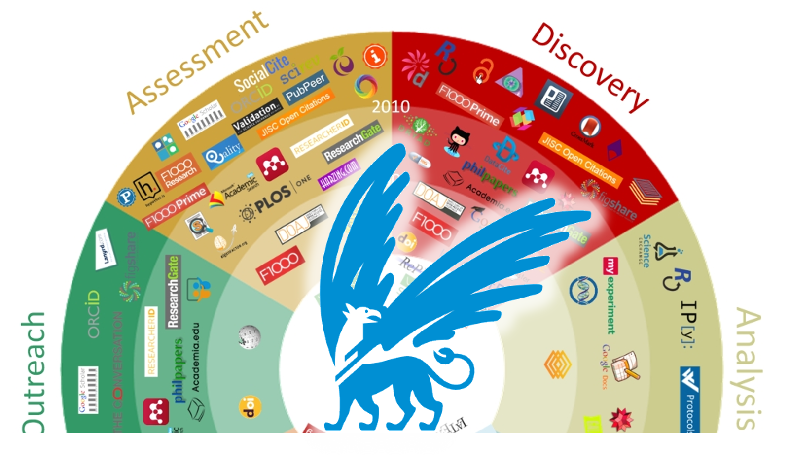
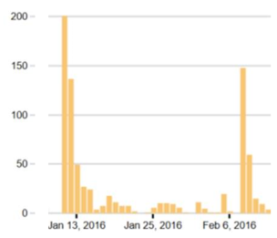
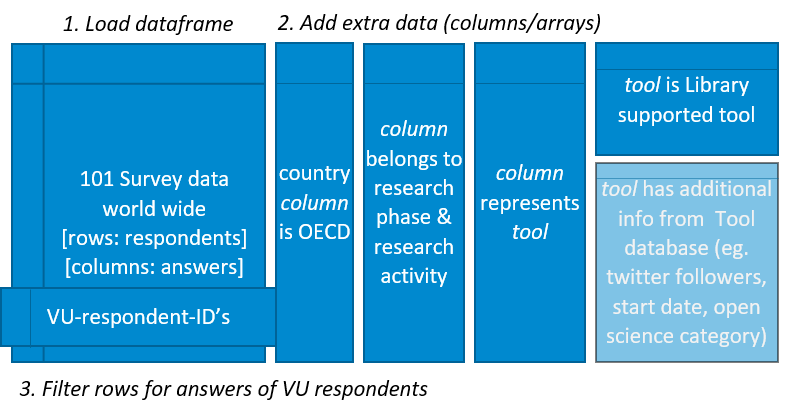
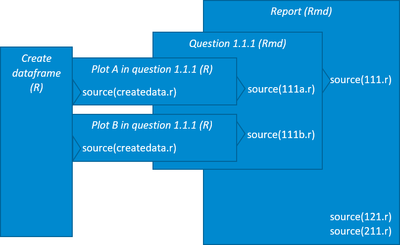
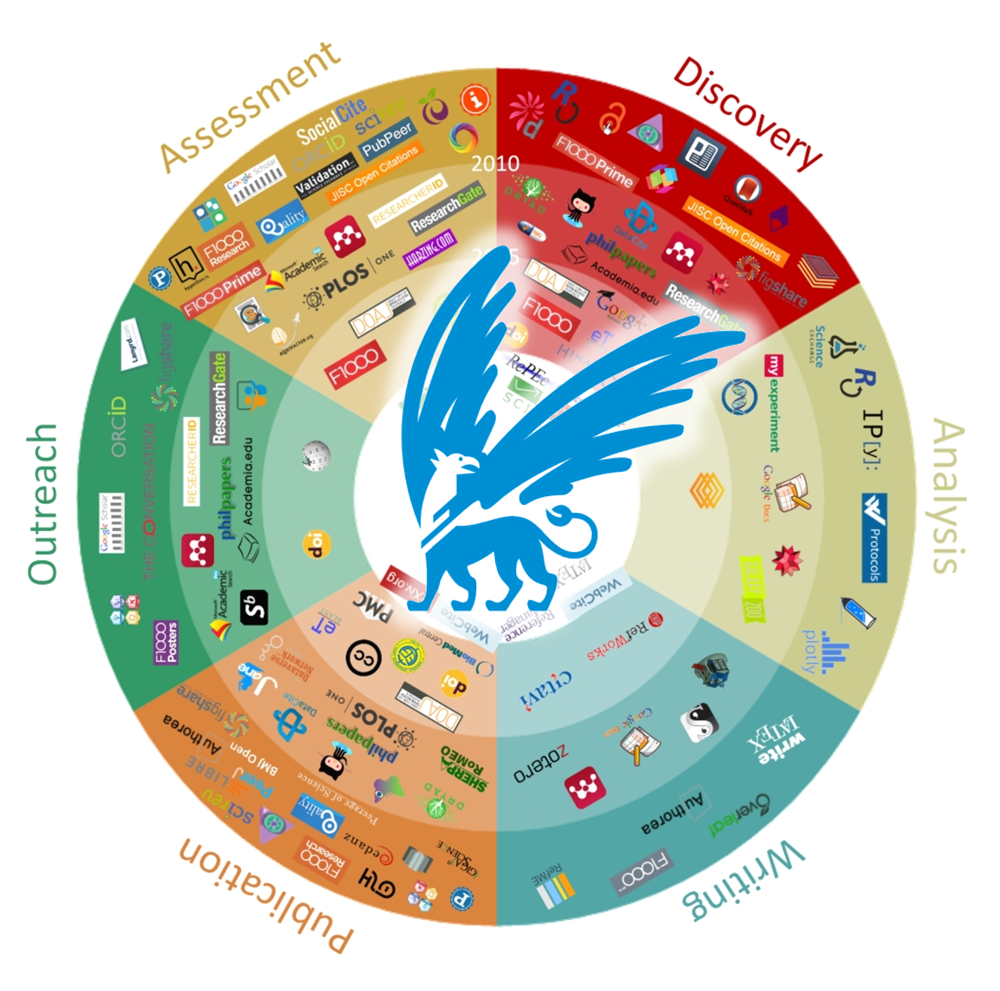

<!-- English or Dutch? First part of the report is written in dutch, then switches to English. Axis titles in the figures are also in Dutch -->



# Introduction

The VU University Library wants her services to be closely connected to the scholarly communication processes of the VU researcher.

<!-- De UBVU wil haar dienstverlening graag zo dicht mogelijk laten aansluiten bij het wetenschappelijke communicatieproces van de onderzoekers van VU en VUmc. -->

The way researchers share and claim their findings (scholarly communicatication) is changing under the influene of the application of new communication technologies. int he digital era, the medium has changes, and influences the way scholars communicate: new ways to *discover* the latest scientific information, setup faster *analyses* designed for reproducibility, *write* collaboratively, *publish* articles and reusable data in new ways on the internet, do the *outreach* of findings in more then one channel, have the *assessement* of findings done in different ways.

<!-- Het wetenschappelijke communicatieproces is volop in beweging. Dit komt door de inzet van digitale middelen binnen de onderzoeksfases: Discovery, Analysis, Writing, Publication, Outreach en Assessment. -->

This project investigates the use of digital tools used in scholarly communication within the VU and VUmc. By pooling in with a global research from Utrecht Univerisity by Kramer and Bosman [1], we can compare our results with other countries.

[1] Kramer, B. and J. Bosman, *Innovations in scholarly communication - global survey on research tool usage* [version 1; referees: awaiting peer review]. F1000Research 2016, 5:692
[(doi: 10.12688/f1000research.8414.1)](http://dx.doi.org/10.12688/f1000research.8414.1)

<!-- Het project doet onderzoek naar naar wat het gebruik is van deze digitale middelen binnen het VU en VUmc, en sluit hierbij aan bij een internationaal onderzoek waardoor resultaten vergeleken kunnen worden met andere landen. -->

The results in this report are ment as conversational material with the faculties to improve library services, in such way they are better improving the work of researchers in their activities in scholarly communication.

<!-- De onderstaande resultaten zijn bedoeld als gespreksstof met de faculteiten om de dienstverlening te verbeteren, vernieuwen en te veranderen, zodat ze beter aansluit bij de fases van de onderzoekspraktijk van de onderzoekers. -->

## Interactive annotating
To bring tools for advancing scholarly communication our selves, we added web anotation to this report using [Hypothes.is](http://Hypothes.is) 
As a reader you can also can make public and private annotations on this URL of this report. (See top-right corner) You can start highlighting the content in this document and save your thoughts for later, or to share with others, right from the browser as you read along. We do encourage you to do so. (In case you save the html file, be aware that web annotations are based on the web address, if the address changes, the annotations will not move with it.)

<!-- inserting Javascript for interactive annotation with Hypothes.is -->
<script language="JavaScript" async defer src="https://hypothes.is/embed.js"></script>


# Method
To start, we have to realise that the survey design was a given to us. We were not involved from the start, but joint this research project from the Utrecht University when it was well underway. The goal of the researchers Kramer and Bosman was to gain insign in what digital online tools were used during different activities of scholarly communication.

## Research questions
Our goal is to improve library services, so we first asked library employees which answers they would like to get from the survey data, devided in two parts:
1. Tool usage of the VU and VUmc researchers as a monolithic group, with comparissons to other parts of the world.
2. Tool usage of the different disciplines of VU and VUmc, also with comparissons to other parts of the world.

All these questions can be found in this document containing the [VU101 research questions](https://docs.google.com/document/d/1p3k5PLXtJNvGviWvsBoPZ4dbgGU9Fa_dHb08iOdvC6Q/edit?usp=sharing). You can also fnid here the prioritation of what questions should be treated first, and the others if time was left for further research.

<!-- # Aanpak
Er zijn [onderzoeksvragen](https://docs.google.com/document/d/1p3k5PLXtJNvGviWvsBoPZ4dbgGU9Fa_dHb08iOdvC6Q/edit?usp=sharing) door de vak- en thema specialisten opgesteld. Dit zijn de vragen die nodig zijn om het gesprek te voeren. Voor elke vraag is een raamwerk gemaakt waarbinnen het antwoord vanuit de enquete resultaten kan worden gegeven. Vanuit het oogpunt tijd, is gekozen om alleen de vragen te beantwoorden met de hoogste urgentie. 

De vragen moeten antwoord geven voor twee vraag-categoriën:
1. Het toolgebruik binnen de VU in haar geheel
2. Het toolgebruik binnen Disciplines

Met name de laatste vraag-categorie is interessant voor vak- en themaspecialisten, waar ze inzicht krijgen in het tool-gebruik binnen de discipline die ze vertegenwoordigen. -->

## Data gathering
Next, we need VU and VUmc researchers to fill in the survey. For this we needed a method to filter these researchers from the data, and we needed to communicate the survey to this specific target group.

For filtering VU and VUmc researchers out of the survey data, we asked the lead researchers to add a hash [7V4u8a] to the survey URL. This custom url can be used in communicating the survey. To monitor the survey activities in realtime ourselves, we created a short URL from the custom URL: [http://bit.ly/vu101innovations] . This url is used in communication to VU and VUmc researchers. 

To communicate this survey to this specific targetgroup within the VU and VUmc, we asked the research portfolio managers to distribute this survey in an e-mail from the faculty secretaries. This resulted in 543 visitors in January, and an extra of 296 after a reminder in February, as you can see in the diagram below.



From a population of 3772 people academic staff at VU and VUmc; we had in total 839 visits (22%) to this short URL. As you can see in the results section, 531 people (14%) finaly filled in the survey.

<!-- Met deze enquete hebben we meegelift bij een bestaand onderzoek van Kramer, B. and J. Bosman, *Innovations in scholarly communication - global survey on research tool usage* [version 1; referees: awaiting peer review]. F1000Research 2016, 5:692
[(doi: 10.12688/f1000research.8414.1)](http://dx.doi.org/10.12688/f1000research.8414.1)

We hebben een custom URL aangevraagd waardoor VU en VUmc onderzoekers in de binnengekomen data is te onderscheiden met de hash 7V4u8a. Van deze custom URL is een verkorte URL gemaakt [http://bit.ly/vu101innovations], zodat we de activiteit van de verspreiding makkelijker bij konden houden. We hebben aan de portefeuillehoudersonderzoek gevraagd deze verkorte URL door te sturen naar hun onderzoekers.


In twee e-mail acties leverde het in januari een activiteit op van 543 bezoekers, en in februari 296 bezoekers, in totaal 839 bezoekers.

De VU en VUmc hebben samen ongeveer 6000 personen wetenschappelijke staf. -->

## Data preparation
In April we got the anonymised and cleaned (eg. removed whitespaces) data from the lead researchers. One set with all the data, and one with only respondents from the VU and VUmc.
We prepared the data for making plots by the following procedure; changing collumns representng a tool from a string value to a bolean value, next adding a boolean to the tool column where the name of the tool has been written down in the free text field for that respondent. Then we added boolean values to the respondents who are affiliated to an institution in a OECD country. After that we marked which column belongs to what research phase in the scolarly communication cycle (Discovery, Analysis, Writing, Publication, Outreach, Assessment), and within these phases what columns represent what reearch activity (eg. searching literature, writing collaboratively, sharing data, ...) After that we labeled what tool are supported by the VU library. Extra information from the tool database (eg. tool age, twitter followers and open science category) could be taken into account for making additional correllations, but due to time limitation we left this out of the answers for now.

```{r, out.width = 500, fig.retina = NULL , echo=FALSE, error=FALSE, warning=FALSE, message=FALSE} 

```

*Data Scaffold: survey dataset enriched with additional data for making plots.*

## Data plots, coding and report rendering 
We chose R as the language to make plots, and the report in this HTML file. For each question we have made a plot in a separate R file to ease the procedure of collaboration, code-commenting and debugging. Then we nested this plot in the R-Markdown (.rdm) format where we could add commenting text like you read here now. All .rdm files are nested in a master report. This allowed us to make a report that immediately updates the plots when the code changes, keeping the graphs in sync with the latest code and data. In the end it saved us time, and makes the repoducibility of this report as easy as possible.

```{r, out.width = 500, fig.retina = NULL , echo=FALSE, error=FALSE, warning=FALSE, message=FALSE} 

```

*Code Scaffold: From data to Report; making separate plots from data, put plots in each question, include commentary, and placing each question in the report.*

# Results
Below you can find the results. The result-sections are based on the research questions. In each section you can find the plots with some commentary information explaining what the plot is about, and what results are expected and unexpected.

Throughout the results the Scholarly Communication Phases will return in each section as seperate paragraphs for Discovery, Analysis, Writing, Publication, Outreach and Assessment.

Also the plots will contain the same colors describing the Scholarly Communication Phases.

<!--
# Resultaten
De vraag-categorien komen ook terug in de nummering van de resultaten.

Elke vraag bevat een antwoord, aangevuld met diagrammen. Een vraag begint met een samenvattende uitleg en diagram en daarna volgen de sub-secties met gedetailleerdere diagrammen.

De Scholarly Communication Fases zullen gedurende het hele rapport terug komen: Discovery, Analysis, Writing, Publication, Outreach en Assessment.
-->



This report has the following result sections:

* The demographics section show numbers on segments of the respondents on the survey regarding countries, carreer groups, and disciplines.
* Popular tools section shows if there is a relation between tools that are suported by the library, and are best known.
* OECD section shows what the differences are between the tool usage of VU and OECD countries.
* Careergroup section show the differences between tool usage of tenured and non-tentured groups.
* Open Science section shows the intention people have regarding open access and open science
* Disciplines section shows the overall tool usage at the VU for each discipline
* Detailed Disciplines section shows the tool usage for each discipline, adding comparisson information such as the OECD number for that discipline, and the VU average.
