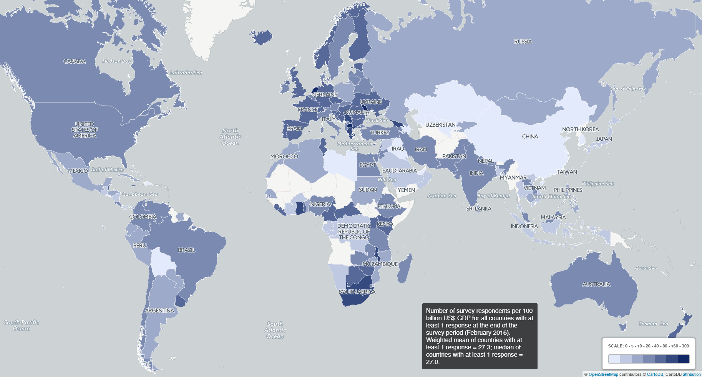

# Demographics
These demographics form the baseline of our study.

## Survey outcomes

| Number of respondents | Value |
| --- | ---: |
| World Wide | 20663 |
| OECD countries | 15752 |
| Netherlands | 2041 |
| VU and VUmc | 531 |

```{r echo=FALSE, warning=FALSE, error=FALSE, fig.keep='first'}
plot_main <- c("respondents: geographical groups")
plot_labels <- c("World Wide", "OECD", "Netherlands", "VU&VUmc")
plot_values <- c(20663, 15752, 2041, 531)
plot_colors <- cm.colors(length(plot_values))

demographicsplot(plot_main, plot_labels, plot_values, plot_colors)

```


[More global demographics...](http://dashboard101innovations.silk.co/page/Demographics)

**The values below are within the set of VU & VUmc respondents.**

| Discipline (multi-choice) | Value |
| --- | ---: |
| Physical Sciences | 39 |
| Engineering and Technology | 35 |
| Life Sciences | 144 |
| Medicine | 181 |
| Social Sciences and Economics | 176 |
| Law | 26 |
| Arts & Humanities | 55 |

```{r echo=FALSE, warning=FALSE, error=FALSE, fig.keep='all'}
plot_main <- c("respondents: Discipline groups")
plot_labels <- c("Physical", "Engi&Tech", "LiveSci", "Medicine", "Socia&Econ","Law","Arts&Hum")
plot_values <- c(39, 35, 144, 181, 176,26,55)
plot_colors <- cm.colors(length(plot_values))

demographicsplot(plot_main, plot_labels, plot_values, plot_colors)
```

| Role | Value |
| --- | ---: |
| Number of PhD's | 230 |
| Number of PostDoc's | 70 |
| Number of (Associate, Assistant) Professors | 188 |

| First publication year | Value |
| --- | ---: |
| before 1991 | 61 |
| 1991-2000 | 70 |
| 2001-2005 | 55 |
| 2006-2010 | 79 |
| 2011-2016 | 168 |
| not published (yet) | 96 |

| Country of affiliation | Value |
| --- | ---: |
| Netherlands | 519 |
| United States | 3 |
| Germany | 2 |
| Brazil | 1 |
| DR of Congo | 1 |
| India | 1 |
| Italy | 1 |
| Latvia | 1 |
| Turkey | 1 |

## Organisation demographics VU&VUmc
Below the numbers are given for the active scientific personel on 30th of June 2016 for the VU. For VUmc (Medicine), numbers from annual report 2015 are used.

| Faculty | Number of scientific personnel |
| --- | ---: |
| Godgeleerdheid | 86 |
| Geesteswetenschappen | 221 |
| Rechtsgeleerdheid | 219 |
| Sociale Wetenschappen | 224 |
| Economische Wetenschappen en Bedrijfskunde | 430 |
| Exacte Wetenschappen | 390 |
| Aard- en Levenswetenschappen | 450 |
| Gedrags- en Bewegingswetenschappen | 422 |
| Geneeskunde (VUmc) | 1079 |
| Tandheelkunde (ACTA) | 251 |

## Survey disciplines and faculty
To normalize the numbers, and calculating the representation of the the survey respontents to the faculties, the following divisions are used.

| Survey Discipline               | Faculty                           | Number of scientific personnel |
| ------------------------------- | --------------------------------- | -----: |
| Physical Sciences               | Exacte wetenschappen              | 195 |
| Engineering and Technology      | Exacte wetenschappen              | 195 |
| Life Sciences                   | Aard- en Levenswetenschappen      | 450 |
| Medicine                        | Aard- en Levenswetenschappen AND Geneeskunde AND Tandheelkunde (ACTA) | 1780 |
| Social Sciences and Economics   | Sociale Wetenschappen AND Economische Wetenschappen en Bedrijfskunde | 654 |
| Law                             | Rechtsgeleerdheid                 | 219 |
| Arts & Humanities               | Godgeleerdheid AND Geesteswetenschappen | 307 |
